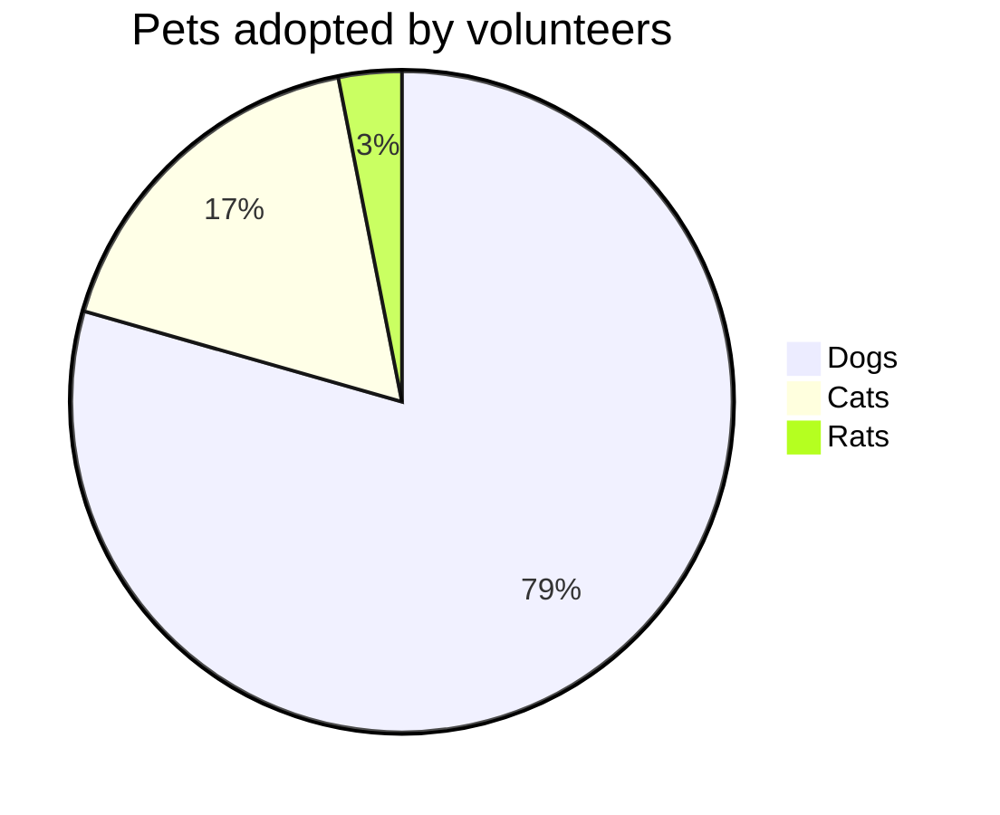

---

title: Now with mermaid
date: 2023-01-13 22:07 PST
tags: middleman, blog

---

I just came across [mermaid](https://mermaid.js.org/#/) and thought it seemed quite cool.  I wanted to implement support for it on my blog, but there wasn't any mention of how to do this with Middleman.  Turns out it wasn't that hard, I just added an import tag to the main page template, then modified the Markdown renderer to create a proper `<pre class="mermaid">` tag around any ````mermaid` code blocks.  Now I can create cool charts and graphs with ease within my markdown.  For example:



If you want to see exactly what this markdown source looks like: As always, you can find a link to the source in the footer of this article.  Cheers.
